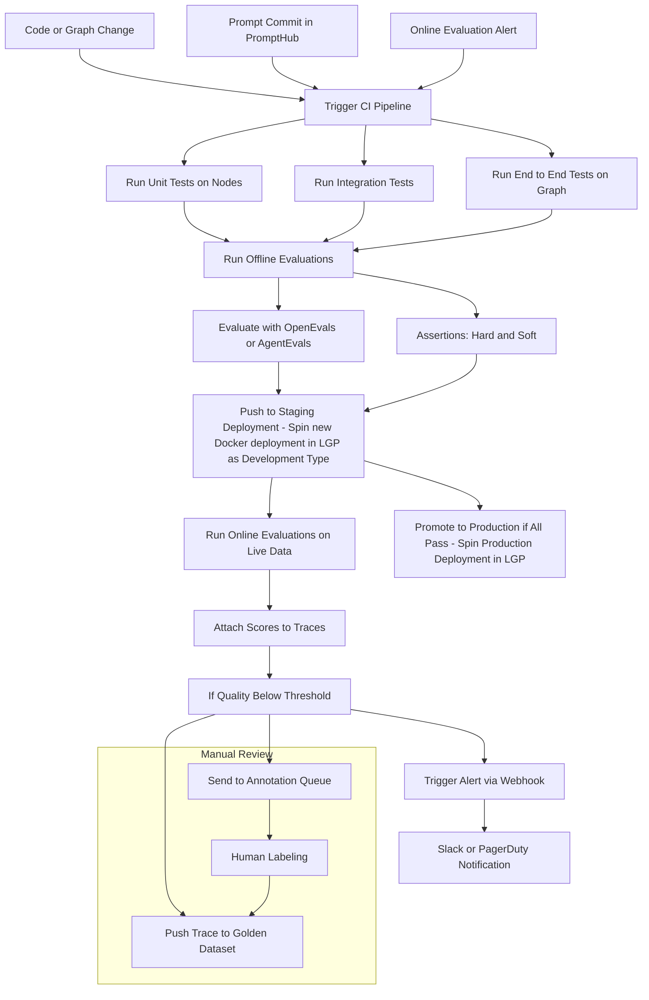

# text2sql-agent 🚀

A powerful text-to-SQL agent that converts natural language queries into SQL statements using LangGraph and LangChain

## 🛠️ Prerequisites

- [uv](https://docs.astral.sh/uv/) - Fast Python package installer and resolver

## 🚀 Quick Start

### 1. Install Dependencies

First, ensure you have `uv` installed. Then run:

```bash
uv sync
```

This will create a virtual environment and install all project dependencies.

### 2. Environment Configuration

Copy the example environment file and configure your variables:

```bash
cp .env.example .env
```

Edit the `.env` file and add your required environment variables.

### 3. Run LangGraph Studio

Start the LangGraph development server to visualize your agent:

```bash
uv run langgraph dev
```

This will start the LangGraph Studio interface where you can interact with and debug your text-to-SQL agent.

## 📁 Project Structure

```
text2sql-agent/
├── agents/           # Agent implementations
├── examples/         # Usage examples
├── helpers/          # Utility functions
└── langgraph.json    # LangGraph configuration
```

## 🔧 Development

- **Virtual Environment**: Managed by `uv` - no need to manually activate
- **Dependencies**: All managed through `pyproject.toml` and `uv.lock`
- **Environment Variables**: Configure in `.env` file

## 🧪 Testing

Run all tests:

```bash
uv run pytest tests/
```

Run specific test categories:

- **Unit tests** (single nodes and utilities):
  ```bash
  uv run pytest -m single_node
  uv run pytest -m utils
  ```

- **Integration tests**:
  ```bash
  uv run pytest -m integration
  ```

- **Offline evaluations** (agent performance evaluation):
  ```bash
  uv run pytest -m evaluator
  ```

### GitHub Actions Environment Setup

If you enable the GitHub Actions workflow, make sure to set the following environment variable in your repository secrets:

- **`OPENAI_API_KEY`**: Your OpenAI API key
- **`LANGSMITH_API_KEY`**: Your LangSmith API key
- **`LANGSMITH_TRACING=true`**: Enable LangSmith tracing


The workflow will automatically run tests and evaluations on pull requests and pushes to main/develop branches

## 🔄 CI/CD Pipeline

CI/CD pipeline to ensure quality and reliability through multiple testing layers and evaluations



### Pipeline Stages

1. **Trigger Sources**: Code changes, graph modifications, prompt updates, or online evaluation alerts
2. **Testing Layers**: Unit tests for individual nodes, integration tests, and end-to-end graph testing
3. **Evaluation**: Offline evaluations using OpenEvals/AgentEvals with hard and soft assertions
4. **Staging**: Deployment to staging environment for live data testing
5. **Quality Gates**: Online evaluations on production-like data with trace scoring
6. **Production**: Promotion to production if all quality thresholds are met
7. **Monitoring**: Continuous monitoring with alerts and manual review processes

## 📚 Examples

Check out the `examples/` directory for usage examples and demonstrations of the text-to-SQL agent capabilities.

## 🤝 Contributing

1. Fork the repository
2. Create a feature branch
3. Make your changes
4. Submit a pull request

## 📄 License

This project is licensed under the MIT License - see the [LICENSE](LICENSE) file for details
